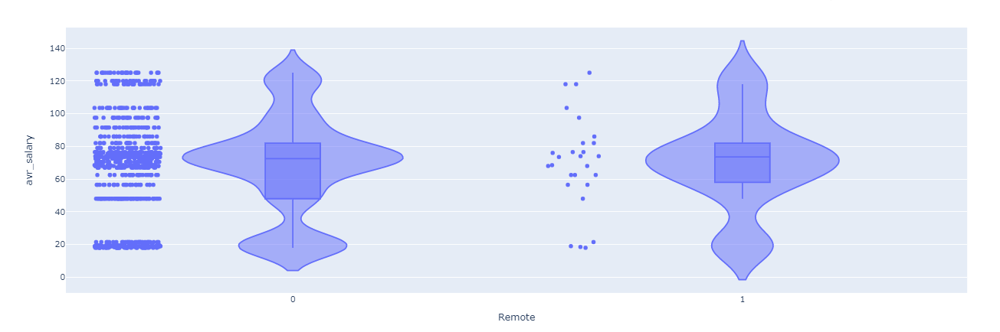

## software-enginners-salary-predictor
# overview

 I have scraped over 900 job description from glassdoor.com using python and selenium for javascript developers in order to create
 machine learning model that can estimate salary for a developer based on some features realated to his skills, during this project
 i followed methodology called CRISP-DM, stands for cross-industry process for data mining, The CRISP-DM methodology provides a 
 structured approach to planning a data mining project.

# web scraping: Data understanding.

 below are the main features that i have been able to scrape or features that can signficantly affect salary:

- Job title
- Salary Estimate
- Job Description
- Rating
- Company
- Location
- Company Headquarters
- Company Size
- Company Founded Date
- Type of Ownership
- Industry
- Sector
- Revenue
- Competitors

# Data Cleaning: Data preparation.

 Data preparation involves transforming raw data in to a form that can be modeled using machine learning algorithms, so in order to
 achieve that goal i had to clean the data and extract some new features from it, below are what i have been able to do.
 
 - made columns from job description field such as html, css, javascript, react, node.......
 - Transformed founded date into age of company.
 - Removed rows without salary.
 - made a column for remote jobs.
 - made a column for hourly paid developers.
 
 # EDA: Data exploration:
 I looked at the distributions of the data and do some univariate and biaviriate analysis. Below are a few highlights from the pivot tables.
 
 
 
 

  
 
 # model building: Data modeling.
 below are the main task for building the model:
 - transforming the data ( categorical ) into dummy varibales.
 - splitting the data into training set and test set.
 - try two different model, a random forest and multiple linear regresion, evaluate them with Mean Absolute Error.
 
